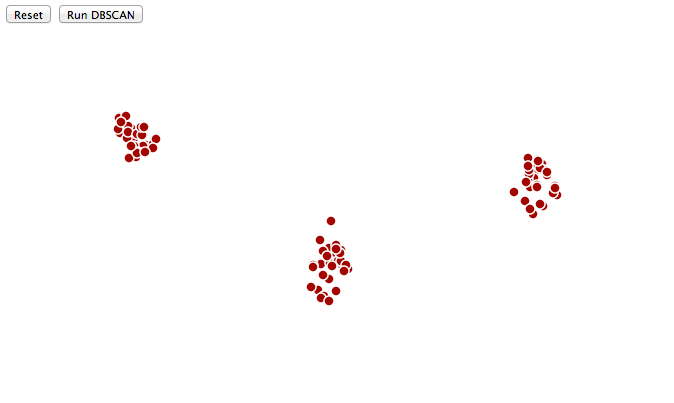
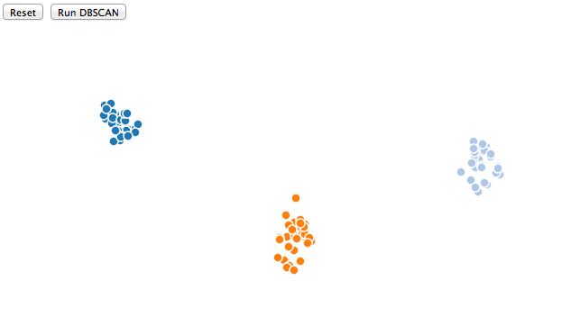

# jDBSCAN 
**Corneliu S.**

---
## Description

**DBSCAN** is a density based clustering algorithm that works by successively growing a cluster from initial seed points **[1]**. If the density in the circle proximity (which has the radius parameter *Eps*) of a point is above or equal a threshold level, denoted by the *MinPts* parameter, the cluster is expanded forward by assigning all the unassigned points in the neighborhood to it. The algorithm then recursively proceeds with the same steps for each of the newly added points to the cluster. Points that will not be assigned to any cluster by the end of this process are labeled as noise. 

**The current implementation supports only two dimensional data.**

**[1]** http://en.wikipedia.org/wiki/DBSCAN

##Additional Features

 The algorithm also works on data points given by ***GPS coordinates***. Moreover, the algorithm can be used on data with a time dimension also. This allows for ***spatio-temporal*** clustering.   
 
##Usage
1. Import the script.

		
		
2. Sample Data Format
####Basic 2D Data
		var point_data = [{ x: 0.1, y: 5}, { x: 2, y: 4}, { x: 0, y: 7}];
####GPS Data
		var gps_point_data = [ { location: {
									accuracy: 30,
									latitude: 55.7858667,
									longitude: 12.5233995
									}
								 },
		                        { location: {
									accuracy: 10,
									latitude: 45.4238667,
									longitude: 12.5233995
									}
								 },
		                       { location: {
									accuracy: 5,
									latitude: 25.3438667,
									longitude: 11.6533995
									}
								 }];
Where accuracy is given in meters.
####Spatial and Temporal Data
		var time_gps_data = [ { location: {
									accuracy: 30,
									latitude: 55.7858667,
									longitude: 12.5233995
									},
								 timestamp: 1349958445
								 },
		                        { location: {
									accuracy: 10,
									latitude: 45.4238667,
									longitude: 12.5233995
									},
									timestamp: 123958445
								 },
		                       { location: {
									accuracy: 5,
									latitude: 25.3438667,
									longitude: 11.6533995
									},
									timestamp: 1350958445
								 }];
								 
		// OR
		
		var time_point_data = [ { x: 0.1, y: 5, timestamp: 1350958445}, 
			                    { x: 2, y: 4, timestamp: 123958445},
			                    { x: 0, y: 7, timestamp: 1349958445} ];
Where **timestamp** is given by the **UNIX timestamp in seconds** for the sample point.

3. Run the algorithm. 
To run the algorithm you need to provide the data along with the **eps** and **minPts** parameters. For the traditional **DBSCAN** the steps are the following: 

		// Configure a DBSCAN instance.
		var dbscanner = jDBSCAN().eps(0.075).minPts(1).distance('EUCLIDEAN').data(point_data);
The distance functions available are: **'EUCLIDEAN', 'HAVERSINE'** (for GPS data), **'MANHATTAN'**.

 	Additionally you can provide your own distance function, which must accept at least two parameters (the two points), and passing it to the *distance* method. The next step is to simply run the clustering algorithm.
		
		// This will return the assignment of each point to a cluster number, 
		// points which have  -1 as assigned cluster number are noise.
		var point_assignment_result = dbscanner();
		
		// (OPTIONAL) If you need the cluster centers for each of the
		// identified clusters use this 
		var cluster_centers = dbscanner.getClusters();
In case of **spatio-temporal data**, as described above, **additional parameters must be supplied**. Such as **time_eps** (difference in seconds used as the time equivalent of the distance eps value).

		var dbscanner = jDBSCAN().eps(0.075).minPts(1).time_eps(1800).data(data);
The default **time distance function** is given by the absolute difference between timestamps. Other functions can be used by passing a function to the *time_distance* method, it also should accept two objects with a *timestamp* field.

		var dbscanner = jDBSCAN().eps(0.075).minPts(1).time_eps(1800).time_distance(custom_function).data(data);
The remaining steps are similar.
##Example
See **example.html**, use the console to view the raw input data and raw output.
####After DBSCAN

